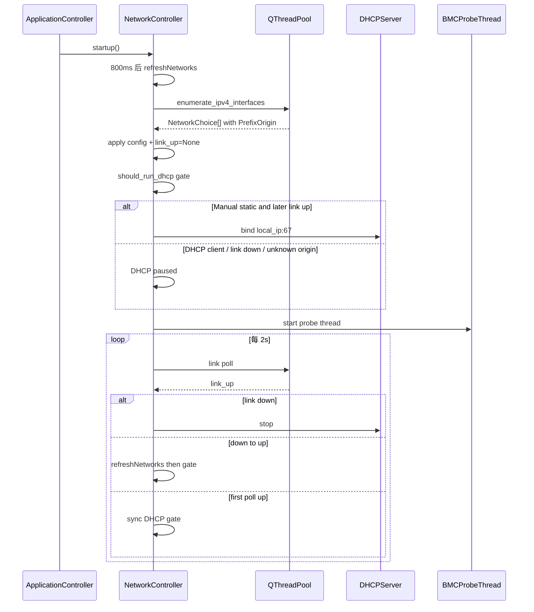

# FruTool 代码设计与架构设计文档

**版本：** 5.3.2.1  
**平台：** Windows 10/11（需管理员权限）  
**技术栈：** Python 3.10+ · PyQt6 · QML · IPMI/DHCP 子进程  
**更新日期：** 2026-07-03

---

## 1. 文档目的与读者

本文档描述 FruTool（FRU 自动化整合工具）的**系统架构**与**代码组织**，供开发、测试、打包与后续迭代参考。

| 读者 | 关注章节 |
|------|----------|
| 新加入开发者 | §2–§5、§8 |
| 测试 / QA | §9、§10 |
| 打包 / 运维 | §7、§11 |
| 产品 / 总控 | §1、§6、§10 业务流程 |

---

## 2. 产品定位与功能边界

FruTool 是面向服务器主板运维的 Windows 桌面工具，通过 BMC 网口（IPMI over LAN）完成：

| 模块 | 能力 | 主要 Domain 模块 |
|------|------|------------------|
| **连接** | 网卡枚举、静态 IP/DHCP 分配、BMC 在线探测 | `network`、`dhcp`、`ipmi` |
| **FRU** | 读取字段提示、批量写入、备份 | `fru_ops`、`ipmi` |
| **换板** | 自动换板（SN 检测→导出→等待换板→克隆）；手动 Step1/2 | `swap/*`、`fru_ops` |
| **拓扑** | PCLE 压缩包 + 裸 .bin 索引、套餐匹配、EEPROM 刷写 | `topo_catalog`、`pcie_topo` |
| **终端** | IPMI / Shell 命令行、日志分 Tab | `ipmi`、`shell_runner` |

**明确不做：** 跨平台 Linux/macOS 支持；云端部署；BMC 固件升级。

---

## 3. 总体架构

### 3.1 分层模型

```
┌─────────────────────────────────────────────────────────────┐
│  QML View（pages / components / dialogs / effects）          │
└───────────────────────────┬─────────────────────────────────┘
                            │ context properties (connVm, …)
┌───────────────────────────▼─────────────────────────────────┐
│  ViewModel（薄 relay，暴露 Controller 属性给 QML）            │
└───────────────────────────┬─────────────────────────────────┘
                            │
┌───────────────────────────▼─────────────────────────────────┐
│  Controller（Qt 信号槽、定时器、Worker 调度、生命周期）          │
└───────────────────────────┬─────────────────────────────────┘
                            │
┌───────────────────────────▼─────────────────────────────────┐
│  Service（无 Qt 的校验、Worker job、会话读写）                  │
└───────────────────────────┬─────────────────────────────────┘
                            │
┌───────────────────────────▼─────────────────────────────────┐
│  Domain（纯 Python 业务逻辑，可单测）                          │
└───────────────────────────┬─────────────────────────────────┘
                            │
┌───────────────────────────▼─────────────────────────────────┐
│  Infrastructure（网络 IO、子进程、线程、日志分类）               │
└─────────────────────────────────────────────────────────────┘
```

### 3.2 依赖规则

| 层级 | 允许依赖 | 禁止 |
|------|----------|------|
| QML | ViewModel、Theme | 直接调用 Controller |
| ViewModel | Controller | Domain / Service |
| Controller | Service、Domain、Infrastructure | — |
| Service | Domain、Infrastructure、config | PyQt Widgets |
| Domain | Infrastructure、config | **PyQt6** |
| Infrastructure | config | Presentation |

**设计原则：** Domain 层零 Qt 依赖，保证 `pytest` + `--cov=frutool.domain` 可覆盖核心业务。

---

## 4. 目录结构与模块职责

```
FruTool/
├── fru_tool.py                 # 兼容入口 → frutool.main
├── frutool/
│   ├── main.py                 # UAC、QApplication、QML 加载、退出生命周期
│   ├── bootstrap.py            # QML 引擎、Theme 单例、ViewModel 注册
│   ├── config.py               # 路径、超时、FRU 字段表、外部工具解析
│   ├── gpu_policy.py           # --no-gpu-effects 启动参数
│   ├── domain/                 # 业务逻辑（见 §5）
│   ├── presentation/           # Qt 层（见 §5.1）
│   ├── infrastructure/         # 底层 IO（见 §5.2）
│   ├── theme/tokens.py         # 设计 token（Python 侧）
│   ├── qml/FruTool/            # QML UI（见 §6）
│   └── demo/topo_demo.py       # 拓扑 UI 演示模式
├── ipmitool/                   # 运行时：ipmitool.exe + 依赖
├── PcieEEpromTool.py           # 拓扑 EEPROM 脚本（打包进 ipmitool/）
├── PCLE/                       # 用户投放拓扑库（按厂商子目录）；加载副本在 _internal/PCLE/
├── FRUTool.spec                # PyInstaller onedir 配置
├── tests/                      # pytest（见 §9）
├── scripts/                    # compile_shaders.ps1、verify_dist.ps1
├── fru_backup/                 # 运行时：FRU 备份、会话、topo 缓存
└── logs/                       # 运行时：会话日志、topo_index.json
```

---

## 5. 代码设计（按层）

### 5.1 Presentation 层

#### Controllers（`frutool/presentation/controller/`）

| 类 | 职责 |
|----|------|
| `ApplicationController` | 根编排：日志、Worker 池、对话框、shutdown；组合子 Controller |
| `ApplicationHost` | 共享依赖容器：models、services、thread pool、log tab 栈 |
| `ConnController` | 凭据 UI；委托 `NetworkController` |
| `NetworkController` | 网卡枚举/重试、链路轮询、DHCP 生命周期、BMC/本机探测 |
| `SwapController` | 手动 + 自动换板门面；进度与 capabilities |
| `ManualSwapController` | 手动 Step1 导出 / Step2 克隆 / 回滚 |
| `AutoSwapSessionController` | 自动模式 phase 状态机、轮询定时器、会话持久化 |
| `AutoSwapWorkflow` | SN 检测、导出、克隆等 Worker 任务链 |
| `OpsController` | FRU 批量写、拓扑匹配/刷写 |
| `TerminalController` | 日志 Dock、Shell/IPMI 命令 |
| `ChromeController` | 导航、主题、关于、窗口 chrome |

#### ViewModels（`frutool/presentation/viewmodels/`）

薄包装层，通过 `_relay.py` 将 Controller 的 `pyqtProperty` / `pyqtSignal` 暴露给 QML：

| VM | QML 上下文名 | 绑定页面 |
|----|--------------|----------|
| `ConnViewModel` | `connVm` | 连接 |
| `SwapViewModel` | `swapVm` | 换板 |
| `FruViewModel` | `fruVm` | FRU |
| `TopoViewModel` | `topoVm` | 拓扑 |
| `TerminalViewModel` | `terminalVm` | 终端 Dock |
| `ChromeViewModel` | `chromeVm` | 壳层导航 |
| `DialogViewModel` | `dialogVm` | 模态对话框 |

#### Services（`frutool/presentation/services/`）

无 Qt 状态机逻辑，供 Controller 在 Worker 中调用：

| 模块 | 职责 |
|------|------|
| `network_runtime_service` | 网卡枚举 job（含 15s 总超时）、链路 poll、DHCP 重启 |
| `network_service` | 网卡摘要、选择索引 |
| `fru_service` | FRU 批量写校验与 job |
| `manual_swap_service` | 手动换板 step 校验 |
| `swap_auto_service` | 自动换板 phase 状态 + 持久化 |
| `swap_service` / `SwapSessionService` | 会话 JSON |
| `topo_service` | 拓扑预加载、匹配、刷写校验 |
| `capabilities_service` | 按钮 enable/disable 规则 |
| `log_presenter_service` | 日志行格式化与 Tab 路由 |

#### Models（`frutool/presentation/models/`）

| Model | 类型 | 用途 |
|-------|------|------|
| `FruFieldModel` | `QAbstractListModel` | FRU 13 字段编辑 + BMC hint |
| `LogLineModel` | 多 Tab 日志行 | Terminal Dock |
| `NetworkListModel` | 网卡下拉列表 | 连接页 |
| `ThemeBridge` | QObject | Python token → QML `Theme` 单例 |

### 5.2 Domain 层（`frutool/domain/`）

| 模块 | 核心 API | 说明 |
|------|----------|------|
| `ipmi.py` | `run_ipmi`, `probe_bmc_ping`, `parse_board_serial` | ipmitool 子进程；frozen 下 Python 解析 |
| `dhcp.py` | `DHCPServer` | UDP/67 线程，为 BMC 分配固定 IP |
| `fru_ops.py` | `run_step1_export`, `run_step2_clone` | FRU 导出/克隆；还原新板 Board Serial，PN 不同时还原 Board Part Number |
| `backup.py` | 备份文件列表 | `fru_backup/` |
| `topo_catalog.py` | `build_topo_index`, `match_topo_candidates` | PCLE 索引（压缩包+裸 bin）、SHA256 签名、缓存校验 |
| `pcie_topo.py` | `run_pcie_topology_write` | 调用 `ipmitool/PcieEEpromTool.py` |
| `swap/auto.py` | `apply_poll_result`, poll/export/clone jobs | 自动换板状态转移 |
| `swap/session.py` | 会话 JSON schema | 断点恢复 |
| `swap/status.py` | 阶段文案 CN/EN | UI 状态条 |

### 5.3 Infrastructure 层（`frutool/infrastructure/`）

| 模块 | 职责 |
|------|------|
| `network.py` | Windows 网卡枚举（PowerShell + ipconfig 回退）、链路查询、IPv4 可用性校验 |
| `workers.py` | `Worker`（QRunnable）、`BMCProbeThread` |
| `shell_runner.py` | 交互式 Shell 子进程与输出流 |
| `log_util.py` | 日志行 → Tab（all/dhcp/fru/topo）分类 |
| `completions/` | IPMI / Shell 命令补全 |

---

## 6. UI 设计（QML）

### 6.1 页面路由

`AppWindow.qml` 通过 `chromeVm.currentPage` 切换：

| 键 | 页面 | 文件 |
|----|------|------|
| `main` | 换板 | `pages/MainPage.qml` |
| `fru` | FRU 编辑 | `pages/FruPage.qml` |
| `topo` | PCIe 拓扑 | `pages/TopoPage.qml` |
| `conn` | 连接设置 | `pages/ConnPage.qml` |

### 6.2 关键组件

| 组件 | 用途 |
|------|------|
| `WorkflowHeader` / `StepCard` | 换板步骤卡片 |
| `AutoSwapPanel` | 自动换板状态与操作 |
| `ConnectionStatusPanel` | BMC/本机/链路状态 |
| `TerminalDock` | 底部日志 + IPMI 终端 |
| `TopoCatalogGrid` / `TopoPickCard` | 拓扑库浏览与候选卡片 |
| `FrostedPanel` + shaders | 毛玻璃视觉效果 |

### 6.3 主题

- Python：`frutool/theme/tokens.py`
- QML 单例：`qml/FruTool/Theme.qml`（经 `ThemeBridge` 同步）

---

## 7. 外部依赖与资源解析

### 7.1 Python 包（pip）

| 包 | 用途 |
|----|------|
| PyQt6==6.8.1 + PyQt6-Qt6==6.8.1 | GUI + QML（二者版号必须一致，禁止单独升级） |
| py7zr / rarfile | PCLE 压缩包读取 |
| pyinstaller | 打包 |

### 7.2 非 pip 运行时

| 资源 | 解析函数 | 查找顺序 |
|------|----------|----------|
| `ipmitool.exe` | `resolve_ipmitool_path()` | `FRUTOOL_IPMITOOL` → exe 旁 `ipmitool/` → `_internal/ipmitool` → PATH |
| `PcieEEpromTool.py` | `resolve_pcie_eeprom_tool()` | exe 旁 / 内置 `ipmitool/PcieEEpromTool.py` |
| `PCLE/` | `pcle_load_dir()` | 用户投放到 exe 旁 `PCLE/<厂商>/`，同步后索引 `_internal/PCLE` |
| Python 解释器（frozen） | `script_python_argv()` | `py -3` → python3 → python（实测 `--version`） |

---

## 8. 并发与线程模型

```
┌──────────────────┐     ┌─────────────────────┐
│  Qt 主线程        │     │  QThreadPool         │
│  · QML 渲染       │     │  · Worker (枚举/FRU/  │
│  · QTimer         │────▶│    拓扑/换板 job)     │
│  · 信号槽         │     └─────────────────────┘
└────────┬─────────┘
         │
    ┌────▼────┐  ┌──────────────┐
    │ BMCProbe│  │ DHCPServer   │
    │ Thread  │  │ Thread       │
    │ (ping)  │  │ (UDP/67)     │
    └─────────┘  └──────────────┘
```

| 机制 | 间隔/超时 | 负责模块 |
|------|-----------|----------|
| 网卡启动刷新 | 延迟 800ms，最多 3 次，间隔 2s | `NetworkController` |
| 网卡枚举 job | 总超时 15s；PS 8s / ipconfig 3s | `network_runtime_service` |
| 链路轮询 | 2s | `NetworkController.link_timer` |
| BMC 探测 | ping 间隔 1.5s，单次 800ms | `BMCProbeThread` |
| 自动换板轮询 | 3s | `AutoSwapSessionController` |
| DHCP ACK 宽限 | 3s 内忽略 bmc offline | `NetworkController._grace_until` |

---

## 9. 核心业务流程

### 9.1 网络启动与 DHCP



**要点：**

- **办公网防护：** 仅当选定网卡被识别为 **Windows DHCP 客户端** 或无可用 IPv4 时暂停内置 DHCP；**链路断开不停服**（换板拔线期间保持监听，避免新板错过 Discover）。
- **绑定范围：** DHCP 监听 `local_ip:67`（选定网卡），不再绑定 `0.0.0.0:67`，降低双网卡误应答。
- 地址来源识别：`Get-NetIPInterface.Dhcp` + `PrefixOrigin`（含 JSON 整型枚举 Manual=1 / Dhcp=3）。
- 先插网线再开程序：链路 up 后按门禁同步 DHCP；down→up 会刷新网卡以识别办公 DHCP。
- 枚举失败/超时：自动重试最多 3 次，仍失败提示手动「刷新网卡」。

### 9.2 自动换板状态机

```
idle ──(BMC online, mode=auto)──► sn_detect ──► sn_confirm
                                              │
                    ◄──(用户取消)──────────────┘
                    │
                    ▼
              exporting ──► wait_swap ──(离线≥3次)──► wait_new ──► cloning ──► done ──► idle
```

- 会话持久化：`fru_backup/swap_session.json`
- 新板等待超时：7200s（2 小时）

### 9.3 拓扑匹配与刷写

```
BMC online → 读 FRU hint (Product Extra / Manufacturer)
         → build_topo_index (PCLE 压缩包+裸 bin + SHA256 签名缓存)
         → match_topo_candidates (校验成员存在后解压/复制 .bin)
         → 展示候选卡片 + 填入 topoPath
         → doTopoWrite → PcieEEpromTool.py (cwd=ipmitool/)
```

**防幻觉机制（v5.1.6+）：** 索引含 SHA256；匹配时二次扫描压缩包；失败清缓存与路径框。

**裸 bin：** 用户放到 exe 旁 `PCLE/<厂商>/`；启动同步到 `_internal/PCLE/` 后递归扫描 `.bin` / zip / 7z / rar。文件名（不含扩展名）= 套餐号。厂商名单与 Infill `KNOWN_VENDORS` 一致（含 LITAO）。不打包出厂压缩包。

---

## 10. 配置常量（`frutool/config.py`）

| 分组 | 代表常量 |
|------|----------|
| 路径 | `BASE_DIR`, `BACKUP_DIR`, `LOG_DIR`, `TOPO_CACHE_DIR` |
| 网络启动 | `NETWORK_STARTUP_DELAY_MS`, `NETWORK_STARTUP_MAX_ATTEMPTS`, `NETWORK_ENUM_JOB_TIMEOUT_S` |
| 换板 | `SWAP_POLL_INTERVAL_MS`, `SWAP_NEW_BOARD_TIMEOUT_S`, `SWAP_OFFLINE_STREAK` |
| FRU | `FRU_FIELDS`（13 字段 IPMI 映射） |
| PCLE | `PCLE_MANUFACTURERS`, `PCLE_PLATFORM_HINTS` |

环境变量：

| 变量 | 作用 |
|------|------|
| `FRUTOOL_SKIP_ADMIN=1` | 跳过 UAC（开发/测试） |
| `FRUTOOL_SMOKE=1` | 跳过网络/DHCP 启动 |
| `FRUTOOL_IPMITOOL` | 指定 ipmitool.exe 路径 |
| `FRUTOOL_DEMO_TOPO=1` | 拓扑 UI 演示模式 |

---

## 11. 打包与部署

```powershell
.\scripts\compile_shaders.ps1          # 修改 .frag 后
pyinstaller --noconfirm --clean FRUTool.spec
.\scripts\verify_dist.ps1
```

**产物：** `dist/FRUTool/FRUTool.exe` + `_internal/`

**内置资源：** QML、ipmitool/、PcieEEpromTool.py（仅 ipmitool/ 下）、图标

**现场覆盖：** 将新版 `ipmitool/` 放在 exe 同目录；拓扑 `.bin` 放入 `PCLE/<厂商>/`（同步到 `_internal/PCLE/` 加载）。

---

## 12. 测试策略

| 类型 | 命令 | 范围 |
|------|------|------|
| Domain 单测 | `pytest -m "not smoke"` | `frutool.domain`，覆盖率 ≥80% |
| Smoke | `FRUTOOL_SMOKE=1 pytest -m smoke` | QML 加载、产物存在性 |
| 关键测试文件 | `test_dhcp*.py`, `test_swap_auto.py`, `test_topo_catalog.py`, `test_network_ipv4.py`, `test_presentation_services.py` | — |

**测试原则：** Domain 纯函数优先；Controller 用 `FakeApplicationHost` 轻量测；不依赖真实 BMC。

---

## 13. 扩展指南

| 需求 | 建议改动位置 |
|------|--------------|
| 新增 FRU 字段 | `config.FRU_FIELDS` + QML 无需改（模型驱动） |
| 新增页面 | `pages/XxxPage.qml` + `ChromeController` 路由 + ViewModel |
| 新厂商 PCLE 命名 | `PCLE_MANUFACTURERS` + 压缩包/目录/文件名 |
| 新 Worker 任务 | Service 中 `run_xxx_job` + Controller `run_worker` |
| 换板流程新阶段 | `swap/auto.py` phase + `AutoSwapWorkflow` + QML 文案 |

**禁止：** 在 Domain 中 import PyQt6；在 QML 中直接调用 Python Controller。

---

## 14. 已知约束与风险

| 项 | 说明 |
|----|------|
| 仅 Windows | 网卡枚举、UAC、DHCP 绑定均依赖 Win32 API |
| 需管理员 | UDP/67 DHCP 需提权 |
| 办公网误配静态 | 若办公网卡误配静态 IP 并开着 FruTool，仍可能对同网段发 OFFER |
| GUI PATH | frozen 程序子进程 PATH 可能与 cmd 不一致；拓扑脚本用 `py -3` + ipmitool cwd |
| PCLE 索引 | 依赖压缩包与裸 bin 的 SHA256；变更后重建索引 |
| BMC DHCP 客户端 | 先插线再开程序时，部分 BMC 需插拔网线才重发 DISCOVER |

---

## 15. 版本历史（架构相关）

| 版本 | 变更 |
|------|------|
| 5.3.2.1 | 修复关闭终端日志面板时错误访问 QML animation id |
| 5.3.2.0 | 深浅主题视觉修订：提高文字对比度、修正浅色玻璃 tint、强化卡片层级 |
| 5.3.1.0 | UI 状态一致性：离线禁用刷写/换板操作、修复提示条件、刷新防连点、统一连接图标语义 |
| 5.3.0.3 | 换板友好：链路 down 不再停 DHCP，避免新板错过 Discover |
| 5.3.0.2 | 未连接/无 IPv4 时不再回落假地址 192.168.1.2，本机显示离线 |
| 5.3.0.1 | 修复静态 IP 被误判 Unknown 导致 DHCP 不启；仅明确 DHCP 客户端才暂停 |
| 5.3.0.0 | PCLE 扫描裸 .bin（递归）；索引签名含 bin；与压缩包一并匹配 |
| 5.2.0.2 | 钉死 PyQt6==6.8.1 与 PyQt6-Qt6==6.8.1（版号必须一致） |
| 5.2.0.1 | 无边框窗口补 Minimize/Maximize flags，修复任务栏点击最小化/还原 |
| 5.2.0.0 | DHCP 办公网防护：仅静态 IP 启服；bind local_ip:67；链路 down 停服；枚举 PrefixOrigin |
| 5.1.6.x | 拓扑索引 SHA256 + 缓存校验；PcieEEpromTool 仅 ipmitool/；网卡启动延迟重试；枚举 15s 超时；DHCP 链路 up 重启 |
| 5.1.4.x | PCLE 拓扑库、TopoCatalogGrid、液态玻璃 UI |

---

## 附录 A：启动调用链

```
fru_tool.py
  └─ frutool.main.main()
       ├─ gpu_policy.configure_startup()
       ├─ _ensure_admin()          # UAC
       ├─ init_runtime_dirs()
       ├─ build_application(app)   # presentation/app.py
       │    └─ ApplicationController.__init__
       │         ├─ conn.startup() → NetworkController.startup()
       │         └─ swap.restore_session()
       ├─ create_qml_engine()      # bootstrap.py
       └─ load_app_window()
```

## 附录 B：日志 Tab 路由

| Tab | 匹配规则（`log_util.py`） |
|-----|---------------------------|
| `dhcp` | DHCP、Discover、OFFER、ACK |
| `fru` | fru、ipmitool fru |
| `topo` | topo、PcieEEpromTool、PCLE |
| `all` | 全部 |

---

*文档维护：架构变更时请同步更新 §9 流程与 §15 版本历史。*
