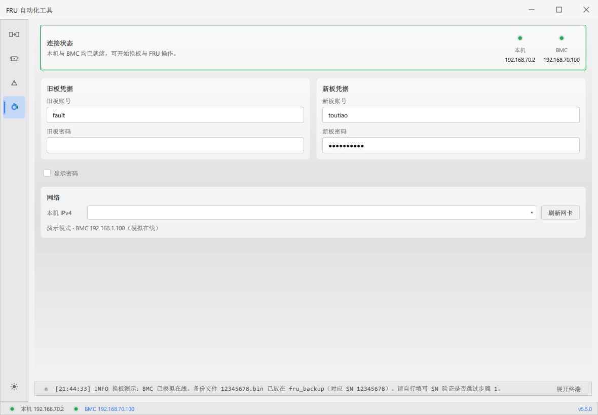
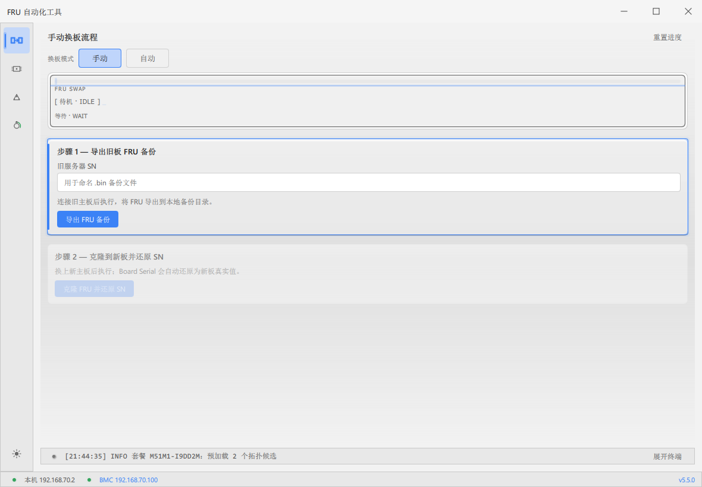
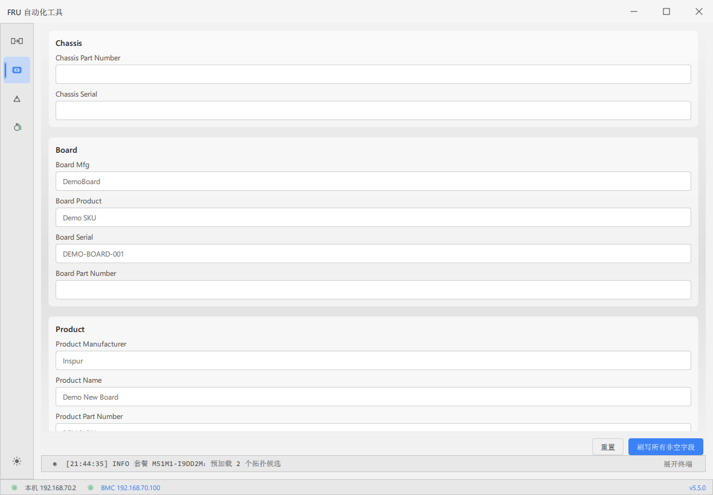
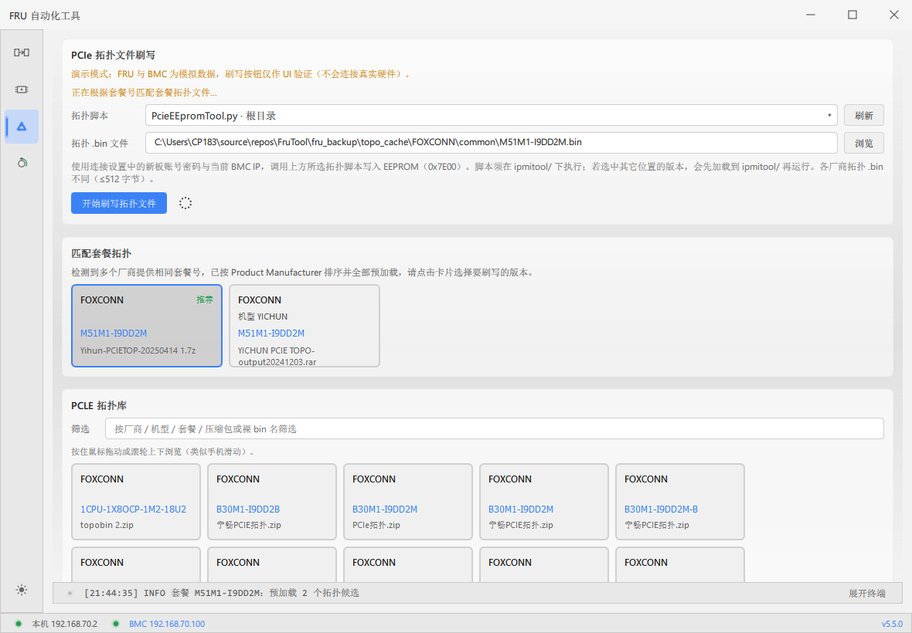

# FRU 自动化工具 — 图文使用教程

**适用版本：** 6.0.0   
**截图说明：** 来自演示模式，仅作界面示意；现场请接真实 BMC。  
**纯文字详版：** [使用说明手册.md](使用说明手册.md) · **网页版：** [使用教程手册.html](使用教程手册.html) · **PDF：** [使用教程手册.pdf](使用教程手册.pdf)（另有英文文件名副本 [FRUTool-UserGuide.pdf](FRUTool-UserGuide.pdf)）


---

## 这是什么工具

FruTool 是面向现场的 **多功能 BMC 运维工具**，四个模块彼此独立，可按任务选用：

| 模块 | 解决什么问题 | 何时用 |
|------|----------------|--------|
| **连接与网络** | 本机网卡、DHCP、旧/新板账号、BMC 是否在线 | **所有写操作前的公共前提** |
| **换板流程** | 旧板 FRU 备份 → 换板 → 克隆到新板并还原新板 SN（PN 不同时一并还原） | 主板更换、整机身份迁移 |
| **FRU 字段刷写** | 按字段读/改 Chassis、Board、Product | 改个别 FRU 字段、核对信息 |
| **PCIe 拓扑刷写** | 把拓扑 `.bin` 写入 EEPROM（0x7E00） | 换板后补拓扑、按机型刷拓扑 |

**使用顺序不是 1→2→3→4 流水线。**  
正确理解是：

```text
          ┌─→ 换板流程
连接就绪 ─┼─→ FRU 字段刷写
          └─→ PCIe 拓扑刷写
```

只做拓扑、只改 FRU、只换板都可以；但只要要访问 BMC，就必须先把 **连接与网络** 配好。

---

## 界面怎么认

左侧活动栏（自上而下）：

1. **换板流程**
2. **FRU 字段刷写**
3. **PCIe 拓扑刷写**
4. **连接与网络**

底部两层：

- **日志条**（内容区最底下）：最新一条日志 + **展开终端**；点开后在窗口右侧（标签、命令行见下文「终端日志区」）
- **状态栏**（窗口最底下）：本机 / BMC 状态灯与 IP；BMC 在线后地址变**蓝**，可点开网页并复制密码
- 版本号、主题切换

启动：双击 `FRUTool.exe`（整个文件夹一起带上），同意管理员 UAC。

---

## 第一步（唯一公共步骤）：连接与网络

所有需要 BMC 的功能都依赖本页。配好一次后，可反复切到其它模块操作。



### 本页有什么

| 区域 | 作用 |
|------|------|
| **连接状态** | 本机、BMC 是否就绪；此处 IP **不能点** |
| **旧板凭据** | 旧主板 BMC 账号/密码（换板读旧板时常用） |
| **新板凭据** | 新主板 BMC 账号/密码（**拓扑刷写、多数写操作默认用这一组**） |
| **显示密码** | 明文查看密码是否填对 |
| **本机 IPv4** | 选择连 BMC 的网卡；**刷新网卡** 重新枚举 |
| 摘要行 | 本机地址、将分配给 BMC 的地址、掩码 |
| **窗口最底下的 BMC 地址** | 在线变蓝后单击：打开 BMC 网页 + 复制对应密码 |

### 推荐操作流程

1. 网线接好（笔记本 ↔ BMC 网口，或同网段可达）。
2. 填写旧板、新板账号密码（现场若只用新板，新板一组必须正确）。
3. 下拉选择正确网卡 → 必要时点 **刷新网卡**。
4. 工具按网卡情况自动处理内置 DHCP（一般无需手工开关；与网上深度远程启动管理器的对比见下）。
5. 等到顶栏/底栏显示 **本机与 BMC 均已就绪**（状态灯为绿）。底栏 `BMC` 后面的地址变成**蓝色**。
6. （可选）单击底栏蓝色地址：打开 BMC 网页，并把当前板密码拷到剪贴板。
7. **到此第一步结束** —— 按任务进入下面任一功能。

### 底栏 BMC 地址变蓝后做什么

可点的是窗口**最底下状态栏**的蓝色 `BMC x.x.x.x`，不是连接页中间状态卡片上的 IP。

1. 单击一次：默认浏览器打开 `http://<BMC地址>`。
2. 同时用 IPMI 先试旧板账号、再试新板账号；哪一组能读到板子，就把**那一组密码**写入剪贴板。
3. 终端出现「已自动复制旧板/新板密码」后，到网页登录框直接粘贴。
4. 两组都试不通时，网页仍会开，但不会复制密码——先核对连接页凭据。

离线时显示 `BMC —`，点不了。

### 内置 DHCP：和网上深度远程启动管理器比什么

**为什么要自带 DHCP：** 当初做这个程序，就是因为现场用网上深度远程启动管理器（下称「网深」）给 BMC 分地址时，**有时会卡住、根本不分配**。网深是给 PC 做 PXE/无盘的大工具，环节多；BMC 只要一个地址，卡在网深里很难判断卡在哪一步。FruTool 只给当前这块 BMC 网口发地址，过程写在终端 **DHCP** 标签（Discover → Offer → ACK），分没分到一眼能看出来。

它**不是网深替代品**（不能拿来装系统/无盘），也**不能同时开**。

| 对比项 | 网上深度远程启动管理器 | FruTool 内置 DHCP |
|------|------------------------|-------------------|
| 要解决的问题 | PC 远程启动、无盘、批量装机 | 网深偶发卡住、BMC 要不到地址 |
| 给谁用 | 给 **PC** | 只给 **BMC** 发一个地址，方便笔记本直连做 IPMI |
| 带什么 | DHCP + TFTP + PXE 菜单，多台机器、地址池 | 只有 DHCP 握手，**没有** PXE、没有启动文件 |
| 地址 | 自己配作用域 / 池 / MAC 绑定 | 按所选**静态网卡**网段固定发一个地址（优先 `.100`） |
| 卡住时 | 界面不一定立刻说明卡在哪 | 打开 **DHCP** 标签：有没有 Discover / Offer / ACK |
| 开关 | 单独开软件、手工配置 | 选对静态网卡后自动运行，没有 DHCP 开关 |
| 办公网 | 容易和现有 DHCP 抢答 | 网卡若是 Windows「自动获取 IP」则**自动暂停** |
| 换板拔线 | 视网深配置 | 拔线仍监听，避免新板错过 Discover |
| 同时开 | 占 **UDP 67** | 67 被占则本工具 DHCP 起不来 → **先关网深**再刷新网卡 |

VMware / Hyper-V 自带 DHCP、Windows 连接共享也会占 67，同样要先关。

### 注意

- 若 Windows 网卡仍是「自动获取 IP」，内置 DHCP 会暂停，请按机房规范改静态或换可用网卡。
- 拓扑页明确使用 **新板账号密码 + 当前 BMC IP**。
- 不要和网深或其它 DHCP/PXE 工具同时抢 67 端口。

---

## 第二步（按任务三选一）

下面三个功能 **互不依赖先后顺序**。连接就绪后，点左侧对应入口即可。

---

### A. 换板流程

**功能介绍**

把旧主板的 FRU 身份备份下来，换上新主板后再写回去。始终还原新板 **Board Serial**；若新旧主板 **Board Part Number** 不一致，再把新板 PN 写回去。支持：

- **手动**：每一步由你点按钮，适合可控现场
- **自动**：BMC 上线后串联读 FRU → 核对 SN → 导出 → 等换板 → 克隆，适合流水作业
- **跳过步骤 1**：`fru_backup` 里已有该 SN 的备份时，填 SN 后可直接克隆
- **回滚**：克隆前会另存新板原始 FRU，出问题可恢复



**备份文件（在 `fru_backup/`）**

| 类型 | 文件名形态 | 用途 |
|------|------------|------|
| 工具导出 | `{SN}_YYYYMMDD_HHMM.bin` | 步骤 1 标准备份 |
| 手导/投放 | `{SN}.bin` | 同样可作为步骤 1 备份识别 |
| 新板原始 | `{SN}_NEW_ORIGINAL_时间戳.bin` | 克隆前备份，供回滚 |

#### A1. 手动换板流程

1. 确认连接页 BMC 在线，进入 **换板流程**，模式选 **手动**。
2. 在步骤 1 填写 **旧服务器 SN**（用于命名备份文件）。
3. 确认连的是 **旧板**，点 **导出 FRU 备份**。
4. 查看日志确认导出成功；文件应出现在 `fru_backup/`。
5. **物理更换主板**，再确认连接页对新板 BMC 在线（网卡/IP/新板密码无误）。
6. 步骤 2 点 **克隆 FRU 并还原 SN**（始终还原新板 Board Serial；PN 不同时一并写回新板 Board Part Number）。
7. 若克隆异常，可用 **回滚新板原始 FRU** 恢复克隆前状态。
8. 需要重来时，用顶部 **重置进度**。

**已有备份时：** 填好 SN 后若工具识别到匹配 `.bin`，可跳过导出，直接做步骤 2。

#### A2. 自动换板流程

1. 连接就绪后进入换板页，切换 **自动**。
2. BMC 上线 → 自动读 FRU → 弹窗核对 SN。
3. 选 **确认并导出**（Product Serial 为空则无法自动继续）或 **取消自动流程**。
4. 导出完成后按提示等待：旧板离线 → 新板上线。
5. 自动执行克隆；全程勿强制结束程序（硬件写入中关程序有损坏风险）。
6. 日志看终端 **FRU** / 全部标签。

---

### B. FRU 字段刷写

**功能介绍**

不整包克隆，只针对当前在线 BMC 的 FRU **字段级**读写：

- 按组编辑：Chassis / Board / Product
- **尝试读取 FRU**：从 BMC 拉当前值填入表单（提示灰字为 hint）
- **刷写所有非空字段**：只写你填了内容的格子
- **重置**：丢掉未提交的编辑

适合：改产品名、改个别序列号、核对 FRU，而不是整机换板。



#### B. 操作流程

1. **第一步连接** 已就绪（BMC 在线）。
2. 侧栏进入 **FRU 字段刷写**。
3. 若显示「尚未读取 FRU 数据」，点 **尝试读取 FRU**。
4. 在各组中修改需要的字段（不必填满；空字段不会被刷）。
5. 确认无误后点 **刷写所有非空字段**。
6. 看终端 **FRU** 标签是否成功；失败时先查账号、在线状态与日志。
7. 想放弃当前编辑：点 **重置**。

**与换板的区别：** 换板是「旧板整包身份 → 新板」；本页是「当前这块板的字段微调」。

---

### C. PCIe 拓扑刷写

**功能介绍**

把厂商提供的 PCIe 拓扑二进制写入主板 EEPROM（偏移 **0x7E00**）。本页包含三块：

| 区域 | 作用 |
|------|------|
| **PCIe 拓扑文件刷写** | 选脚本、选 `.bin`、开始刷写 |
| **匹配套餐拓扑** | 根据新板 FRU 套餐号预加载候选卡片（多厂商时可选） |
| **PCLE 拓扑库** | 浏览/筛选整库压缩包与散落 `.bin` |

脚本支持多版本：`PcieEEpromTool*.py`，下拉选择，并记住上次选择。



#### C. 操作流程

1. **第一步连接** 已就绪；新板账号密码正确。
2. 进入 **PCIe 拓扑刷写**。
3. **拓扑脚本** 下拉选择版本；新放了文件就点 **刷新**。  
   - 扫描：exe 旁、`ipmitool/`、打包内置  
   - **执行约束：** 真正运行必须在 `ipmitool/` 目录。其它位置选中的文件，刷写前会 **加载** 为 `ipmitool/PcieEEpromTool_run.py`（不覆盖原来的 `PcieEEpromTool.py`）。  
   - 现场建议多版本直接放进 exe 旁 `ipmitool/`。
4. 准备拓扑 `.bin`（三选一）：
   - **浏览**：任意位置选一次就刷（U 盘、桌面均可，不必拷进程序）
   - 点 **匹配套餐拓扑** 里带「推荐」的卡片（要事先把对应套餐的文件放进 `PCLE/<厂商>/`）
   - 在 **PCLE 拓扑库** 用筛选框按厂商/机型/套餐/包名查找后点选
5. 确认路径与脚本无误，点 **开始刷写拓扑文件**。
6. 结果看终端 **拓扑** 标签。

**拓扑 .bin 自己放哪（现场会补文件）**

| 用法 | 放哪 |
|------|------|
| 进库、按套餐自动匹配 | **`FRUTool.exe` 同目录 `PCLE/<厂商>/`**（启动时自动建厂商文件夹） |
| 只刷这一次 | 任意路径，点 **浏览** |

进库注意：

- 启动后 exe 旁会有 `PCLE/Inspur`、`PCLE/FOXCONN`、`PCLE/LITAO` 等（厂商名单与 Infill 一致）
- 把 `.bin` 或 zip/7z/rar 放进对应厂商文件夹；**文件名（不含扩展名）= 套餐号**
- 例如 `PCLE/Inspur/S62D1-I8DD2M-L.bin`
- 单个文件 **≤ 512 字节**
- 程序同步到 `_internal/PCLE/` 再加载；不要手改 `_internal`，不要放 `fru_backup/` 或 `ipmitool/`
- 放好后切到拓扑页点 **刷新**（或重新打开工具）才会进库

打包版不再内置出厂压缩包。

**打包版注意：** 拓扑脚本由本机 Python 执行，需 `python` 或 `py -3` 可用；装好后重新打开工具以便继承 PATH。

---

## 公共能力：终端日志区

窗口内容区最底下是**日志条**（最新一条 + **展开终端**）。点这条或点按钮，右侧打开终端面板（可拖左边细条改宽度）。再往下的状态栏是本机/BMC 地址，不是日志条。

### 日志面板

| 操作 | 说明 |
|------|------|
| **全部 / DHCP / FRU / 拓扑** | 四个标签。DHCP 看分地址，FRU/换板看刷写，拓扑看 EEPROM |
| 未读数字 | 面板收起或没看这个标签时，新日志会在标签上出数字 |
| **清空** | 只清当前标签 |
| **收起** | 关右侧面板，底栏变回日志条 |

排障：DHCP 卡住切 **DHCP**；换板/字段刷写切 **FRU**；拓扑切 **拓扑**。

### 命令行（面板底部）

| 控件 | 说明 |
|------|------|
| **IPMI / 自由** | IPMI：发 ipmitool 子命令（如 `fru list 0`），自动带 BMC 地址和账号密码。自由：本机 Shell |
| **新 / 旧** | 仅 IPMI：用连接页的新板或旧板凭据 |
| 回车 | 执行 |
| Tab | 补全 |
| ↑ / ↓ | 历史 |
| Ctrl+C | 自由模式下打断正在跑的命令 |

IPMI 结果出现在 **FRU**（及全部）标签。刷写进行中不要乱发会改 FRU/EEPROM 的命令。

### 相对 exe 的目录

| 路径 | 用途 |
|------|------|
| `ipmitool/` | ipmitool.exe、拓扑脚本（现场覆盖内置） |
| `PCLE/` | 用户投放拓扑 `.bin` / 压缩包（按厂商子目录；启动自动建）。加载目录是 `_internal/PCLE/` |
| `fru_backup/` | FRU 备份、换板会话、拓扑解压缓存 |
| `logs/` | 按日日志、`topo_index.json`、`topo_prefs.json` |

---

## 场景速查（连好之后怎么选模块）

| 现场目标 | 去做 |
|----------|------|
| 只换主板、迁移 FRU 身份 | **换板流程**（手动或自动） |
| 只改几个 FRU 字段 | **FRU 字段刷写** |
| 只刷 PCIe 拓扑 | **PCIe 拓扑刷写** |
| 换板后再刷拓扑 | 先 **换板**，再 **拓扑**（都仍只需一次连接配置） |
| 已有 `{SN}.bin`，只写到新板 | 换板页填 SN → 跳过步骤 1 → 克隆 |

---

## 常见问题

| 现象 | 处理 |
|------|------|
| BMC 一直离线 | 网线、网卡选择、账号密码、是否管理员运行；先关掉网上深度远程启动管理器再刷新网卡 |
| 底栏 BMC 不变蓝 / 点了没反应 | 等在线后再点；点的是**窗口最底下**蓝色地址，不是中间状态卡片 |
| 网页开了但密码没进剪贴板 | 核对旧板/新板凭据；看终端是否提示无法判断板型 |
| 日志在哪 / 怎么展开 | 点内容区最底下那条日志或「展开终端」，面板在右侧 |
| DHCP 标签没有 ACK | 网深是否还开着；网卡是否静态；看 DHCP 标签停在 Discover 还是 Offer |
| DHCP 起不来 | 关掉网深及其它占 UDP 67 的工具，管理员运行后刷新网卡 |
| 拓扑刷写失败 | 脚本是否落入 `ipmitool/`；`.bin` 是否 ≤512 字节；拓扑日志；本机 Python |
| 库里找不到刚放的拓扑 bin | 是否在 **`PCLE/<厂商>/`**；文件名是否等于套餐号；放完后是否点拓扑页 **刷新** |
| 找不到拓扑脚本 | 放入 `ipmitool/`，点刷新 |
| 换板找不到备份 | SN 与 `fru_backup` 中 `{SN}.bin` / `{SN}_时间戳.bin` 是否一致 |
| 刷写中误关程序 | 硬件写入未完成可能损坏 EEPROM，尽量等完成或按提示操作 |

---

## 相关文档

- [使用说明手册.md](使用说明手册.md)
- [CHANGELOG.md](../CHANGELOG.md)
- 重新截图：`.\.venv\Scripts\python.exe scripts\capture_manual_shots.py`
